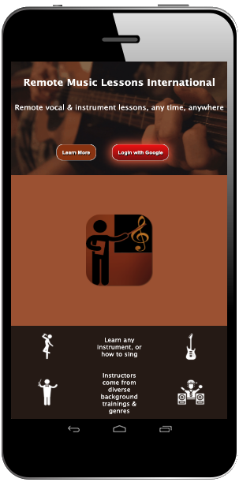

# Remote-Music-Lessons
This CRUD web app enables music instructors to connect remotely with students for music lessons. Most other music lesson services have the instructor dictate the availability times of the lessons, and while this app still allows that, I wanted to also enable a customer-first model where the client stipulates what they want to learn and the time they want to learn it.

This serves as primarily a teacher-student coordination and lesson plan tool, as well as a marketable platform. Other tools such as zoom, gmail and slack are used for the communication of the lessons.

**Technologies Used:** Javascript, HTML, CSS, NodeJS, Express, MongoDB, Mongoose, Google OAuth, Paint.net.

**Getting Started:** [Link to the App](https://remotemusiclessons.herokuapp.com/)

Getting started is simple, with Google's OAuth you just sign in with your Google account. Once signed in, just click the large central button "Reserve a Lesson" to choose the subject and time you want. An instructor will then reach out to you shortly.

If you wish to be an instructor, sign up as a student, then reach out to me at one of my listed emails so we can discuss your experience. If everything is kosher, I'll send you a link to turn on your instructor status.

**Dev**
[Trello](https://trello.com/b/i206FzLj/remote-music-lessons-international)

**Next Steps:**
* Search capability
* Profile pages
* Export data as csv

